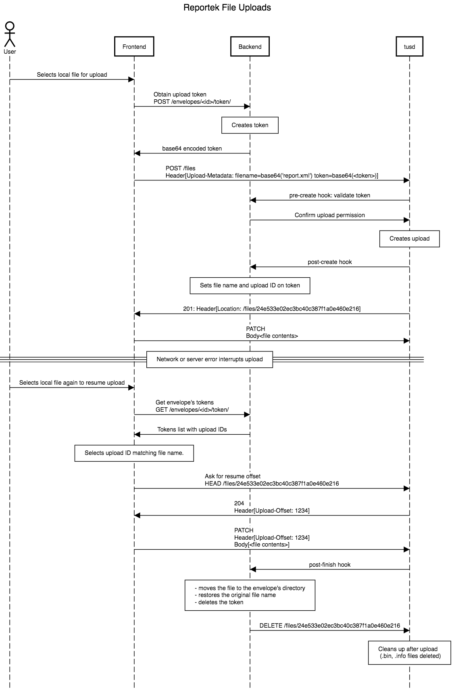

Resumable envelope file uploads
===============================

Reportek supports resumable file uploads using the tus_ protocol.
A tusd_ server (the Go reference implementation) receives the uploads from
the frontend, and uses HTTP hooks to integrate with the Reportek backend for
authorization, validation and final processing.

Examples below were run using httpie_ to query a local instance of tusd_::

    tusd -hooks-http http://127.0.0.1:8000/api/0.1/uploads/

The above Reportek endpoint dispatches requests to internal tusd_ hook handlers:
 - ``pre-create`` validates the upload token, metadata and user authentication before allowing the upload to proceed.
 - ``post-finish`` copies the finished file from tusd_'s data directory to the envelope’s file storage directory.
 - ``post-create``, ``post-receive`` and ``post-terminate`` currently only log the respective tusd_ event.

Query server capabilities
-------------------------

The response header ``Tus-Extension`` indicates the extensions implemented by
this tusd_ server implementation.

.. code-block:: none
   :caption: Request:

   http OPTIONS http://localhost:1080/files/ Tus-Resumable:1.0.0

.. code-block:: none
   :caption: Response:

   HTTP/1.1 200 OK
   Content-Length: 0
   Content-Type: text/plain; charset=utf-8
   Date: Fri, 01 Dec 2017 11:40:28 GMT
   Tus-Extension: creation,creation-with-upload,termination,concatenation
   Tus-Resumable: 1.0.0
   Tus-Version: 1.0.0
   X-Content-Type-Options: nosniff

Obtain an upload token
----------------------

Uploads require a Reportek-issued token for the logged in user and envelope.

.. code-block:: none
   :caption: Request:

   http POST http://localhost:8000/api/0.1/envelopes/4/token/

.. code-block:: none
   :caption: Response:

   HTTP/1.0 200 OK
   {
      "token": "WGVVQWprVHZObll2NHNGeTFaTzdwb1lLUVl1dGZDZFFxWW5YTFRxWDV1M3Bxd3R5aG9lUkxkRHFURmdZb0g1aQ=="
   }

Create new upload
-----------------

We’re uploading a file named ‘file_sample.xml’, 1820041 bytes in size.
Since tusd_ will store the uploaded data under a unique name it generates internally,
we use the ``Upload-Metadata`` header to preserve any non-payload data about the upload.

.. note::
 - Reportek **requires** the metadata keys ``token`` and ``filename``.
 - values in ``Upload-Metadata`` key-value pairs **must** be base64 encoded for tusd_.

.. code-block:: none
   :caption: Request:

   http POST http://localhost:1080/files/ \
   Tus-Resumable:1.0.0 \
   Upload-Metadata:'token SEJjU0NVZTZybEM0ajFZT1d4d0k2d3ZXS1kxbkpyZkQyTmttVzdBcWdmUHNkUm1QZ2NFMXEycjR1WnVhaVlNZA==, filename ZmlsZV9zYW1wbGUueG1s' \
   Upload-Length:1820041 \
   Content-Type:application/offset+octet-stream

.. code-block:: none
   :caption: Response:

   HTTP/1.1 201 Created
   Content-Length: 0
   Content-Type: text/plain; charset=utf-8
   Date: Fri, 01 Dec 2017 13:08:04 GMT
   Location: http://localhost:1080/files/c71fc15b393082f889b16e2443ae41f4
   Tus-Resumable: 1.0.0
   Upload-Offset: 0
   X-Content-Type-Options: nosniff

.. note::
  The URL to use for actual data upload is indicated in the ``Location`` header.*

Hooks triggered:
^^^^^^^^^^^^^^^^

**pre-create** (body contents of POST request received by the hooks HTTP endpoint)

.. code-block:: python

    {
      'ID': '',
      'Size': 1820041,
      'Offset': 0,
      'MetaData':
        {
          'token': 'HBcSCUe6rlC4j1YOWxwI6wvWKY1nJrfD2NkmW7AqgfPsdRmPgcE1q2r4uZuaiYMd',
          'filename': 'file_sample.xml'
        },
      'IsPartial': False,
      'IsFinal': False,
      'PartialUploads': None
    }

.. note::
  - at this stage the upload has not yet been issued an ID.
  - Reportek will fill in the `filename` field on the token at this point.
  - tusd_ hooks send meta data values decoded from their posted base 64 content.

Assuming a positive response from the ``pre-create`` hook, the creation proceeds:

**post-create**

.. code-block:: python

    {
      'ID': 'c71fc15b393082f889b16e2443ae41f4',
      'Size': 1820041,
      'Offset': 0,
      'MetaData':
        {
          'token': 'HBcSCUe6rlC4j1YOWxwI6wvWKY1nJrfD2NkmW7AqgfPsdRmPgcE1q2r4uZuaiYMd',
          'filename': 'file_sample.xml'
        },
      'IsPartial': False,
      'IsFinal': False,
      'PartialUploads': None
    }

**post-receive**

.. code-block:: python

    {
      'ID': 'c71fc15b393082f889b16e2443ae41f4',
      'Size': 1820041,
      'Offset': 0,
      'MetaData':
        {
          'token': 'HBcSCUe6rlC4j1YOWxwI6wvWKY1nJrfD2NkmW7AqgfPsdRmPgcE1q2r4uZuaiYMd',
          'filename': 'file_sample.xml'
        },
      'IsPartial': False,
      'IsFinal': False,
      'PartialUploads': None
    }

.. note::
  - the ``IsPartial``/``IsFinal`` hook notification fields do **NOT** indicate the actual completeness of a regular resumable upload, and are only relevant when using the ``Concatenation`` extension (not currently used by Reportek).
  - Reportek will fill in the `tus_id` field on the token at this point.

Uploads storage
^^^^^^^^^^^^^^^

Upon a successful POST request, tusd_ will create a pair of ``<ID>.bin`` and
``<ID>.info`` files in its data directory. The former will store the upload’s data,
while the latter holds the upload’s status and metadata.

A partial upload
----------------

We simulate an interrupted upload by sending our file without the last 41 bytes.

.. code-block:: none
   :caption: Request:

   head -c1820000 file_sample.xml | http PATCH http://localhost:1080/files/c71fc15b393082f889b16e2443ae41f4 \
   Tus-Resumable:1.0.0 \
   Upload-Length:1820000 \
   Upload-Offset:0 \
   Content-Type:application/offset+octet-stream

.. code-block:: none
   :caption: Response:

   HTTP/1.1 204 No Content
   Date: Fri, 01 Dec 2017 13:08:56 GMT
   Tus-Resumable: 1.0.0
   Upload-Offset: 1820000
   X-Content-Type-Options: nosniff

Hooks triggered
^^^^^^^^^^^^^^^

**post-receive**

.. code-block:: python

    {
      'ID': 'c71fc15b393082f889b16e2443ae41f4',
      'Size': 1820041,
      'Offset': 1820000,
      'MetaData':
        {
          'token': 'HBcSCUe6rlC4j1YOWxwI6wvWKY1nJrfD2NkmW7AqgfPsdRmPgcE1q2r4uZuaiYMd',
          'filename': 'file_sample.xml'
        },
      'IsPartial': False,
      'IsFinal': False,
      'PartialUploads': None
    }

Resuming uploads
----------------

An interrupted upload can be resumed by PATCHing requests to its initial URL.

First we'll query Reportek on the envelope's tokens, to get the ``tus`` ID :

.. code-block:: none
   :caption: Request:

   http GET http://localhost:8000/api/0.1/envelopes/4/token/                                                                                                                                          473ms

.. code-block:: none
   :caption: Response:

   HTTP/1.0 200 OK
   Allow: GET, POST, HEAD, OPTIONS
   Content-Length: 202
   Content-Type: application/json
   Date: Fri, 01 Dec 2017 13:09:10 GMT
   Server: WSGIServer/0.2 CPython/3.6.3
   Vary: Accept, Cookie
   X-Frame-Options: SAMEORIGIN

   [
       {
           "created_at": "2017-12-01T13:08:04.438469Z",
           "filename": "file_sample.xml",
           "id": 23,
           "token": "HBcSCUe6rlC4j1YOWxwI6wvWKY1nJrfD2NkmW7AqgfPsdRmPgcE1q2r4uZuaiYMd",
           "tus_id": "c71fc15b393082f889b16e2443ae41f4"
       }
   ]

Next we ask ``tusd`` for status on the upload, to know where to resume from:

.. code-block:: none
   :caption: Request:

   http HEAD http://localhost:1080/files/c71fc15b393082f889b16e2443ae41f4 \
   Tus-Resumable:1.0.0

.. code-block:: none
   :caption: Response:

   HTTP/1.1 200 OK
   Cache-Control: no-store
   Content-Type: text/plain; charset=utf-8
   Date: Fri, 01 Dec 2017 13:09:12 GMT
   Tus-Resumable: 1.0.0
   Upload-Length: 1820041
   Upload-Metadata: filename ZmlsZV9zYW1wbGUueG1s
   Upload-Offset: 1820000
   X-Content-Type-Options: nosniff

Finally, we resume from the offset indicated by the server, and finish the upload:

.. code-block:: none
   :caption: Request:

   tail -c+1820001 file_sample.xml | http PATCH http://localhost:1080/files/c71fc15b393082f889b16e2443ae41f4 \
   Tus-Resumable:1.0.0 \
   Upload-Length:41 \
   Upload-Offset:1820000 \
   Content-Type:application/offset+octet-stream

.. code-block:: none
   :caption: Response:

   HTTP/1.1 204 No Content
   Date: Fri, 01 Dec 2017 13:09:58 GMT
   Tus-Resumable: 1.0.0
   Upload-Offset: 1820041
   X-Content-Type-Options: nosniff

Hooks triggered:
^^^^^^^^^^^^^^^^

**post-receive** & **post-finish**

.. code-block:: python

    {
      'ID': 'c71fc15b393082f889b16e2443ae41f4',
      'Size': 1820041,
      'Offset': 1820041,
      'MetaData':
        {
          'token': 'HBcSCUe6rlC4j1YOWxwI6wvWKY1nJrfD2NkmW7AqgfPsdRmPgcE1q2r4uZuaiYMd',
          'filename': 'file_sample.xml'
        },
      'IsPartial': False,
      'IsFinal': False,
      'PartialUploads': None
    }

.. note::
  - while tusd_ will issue the ``post-receive`` event before ``post-finish``, it’s possible they will be received by the hooks target in reverse order.
  - upon receiving ``post-finish``, Reportek will:
      - use the metadata to move the file from tusd_'s data directory to the appropriate envelope, and with its original name.
      - delete the token.
  - the current behaviour on receiving a file with a name already present on the envelope is to replace the existing one.

Delete an upload
----------------

This is refered to in the protocol spec as ‘termination’, which is NOT meant as 'finishing an upload'.
Terminating an upload will cause tusd_ to delete the actual ``.bin`` and ``.info`` files from its data directory.

.. code-block:: none
   :caption: Request:

   http DELETE http://localhost:1080/files/c71fc15b393082f889b16e2443ae41f4 \
   Tus-Resumable:1.0.0

.. code-block:: none
   :caption: Response:

   HTTP/1.1 204 No Content
   Date: Fri, 01 Dec 2017 13:13:06 GMT
   Tus-Resumable: 1.0.0
   X-Content-Type-Options: nosniff

Hooks triggered:
^^^^^^^^^^^^^^^^

**post-terminate**

.. code-block:: python

    {
      'ID': 'c71fc15b393082f889b16e2443ae41f4',
      'Size': 1820041,
      'Offset': 0,
      'MetaData':
        {
          'token': 'HBcSCUe6rlC4j1YOWxwI6wvWKY1nJrfD2NkmW7AqgfPsdRmPgcE1q2r4uZuaiYMd',
          'filename': 'file_sample.xml'
        },
      'IsPartial': False,
      'IsFinal': False,
      'PartialUploads': None
    }

.. note::
  - ``post-terminate`` will cause Reportek to delete the token.

Sequence diagram
----------------

.. _tus: https://tus.io/protocols/resumable-upload.html
.. _tusd: https://github.com/tus/tusd
.. _httpie: https://httpie.org/
